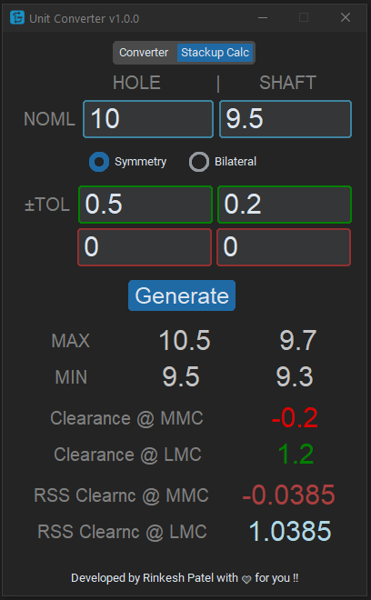
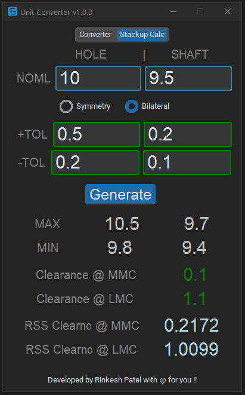

# Unit_converter
Unit converter for general purpose
 - Unit converter is an offline standalone software developed for windows OS
 - Enter the number and the software will conver the number in Inch and Milimeter unit
 - Converted number can be copied by single click
 - Converted number will be round to 4 digit after decimal
 - The software is for mechanical designer, machinist or whoever is working in similar industry where frequent unit conversion is required on daily and regular basis
  

# Releases

**Unit Converter (Version: 1.0.0) First Release: <a href="https://github.com/rp-4/unit_converter/releases/tag/v1.0.0">Download Here </a>**

- Copy button added for both units, so user can copy converted number to clipboard
- Add a 'Stackup calculator' in a new tab
- User can select either Symmetry or Bilateral tolerance
- Minus tolerance will be disabled when Symmetry will be selected and Plus tolerance will be consider for both Min and Max conditon
- Added MAX & MIN condition calculations
- Added clearance when both hole & shaft are at MMC and LMC
- If there is interference at MMC, the font will be red; otherwise, it will be green
- Added RSS Gap when both at MMC and LMC
- Calculate unit conversion and tolerance by pressing Enter key as well

 

 

  

 

