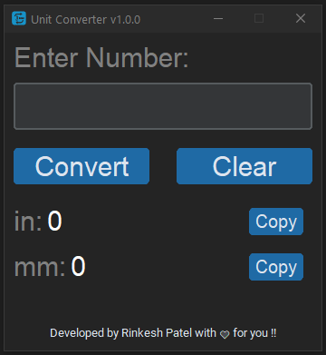
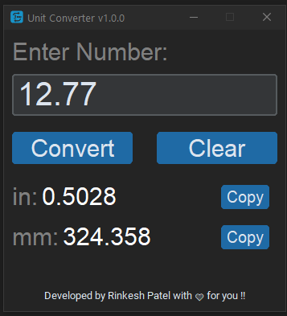

# unit_converter
Unit converter for general purpose
 - Unit converter is an offline standalone software developed for windows OS
 - Enter the number and the software will conver the number in Inch and Milimeter unit
 - Converted number can be copied by single click
 - Converted number will be round to 4 digit after decimal
 - The software is for mechanical designer, machinist or whoever is working in similar industry where frequent unit conversion is required on daily and regular basis

 

 

  

 

